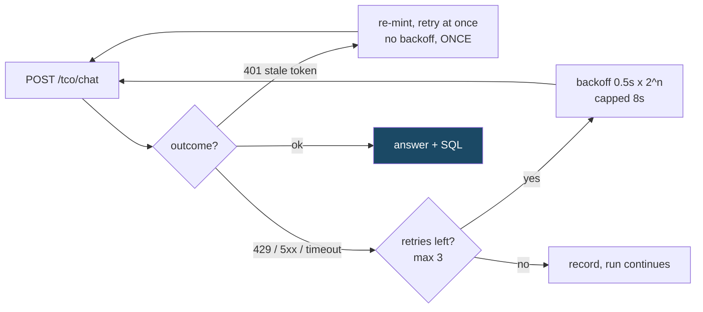
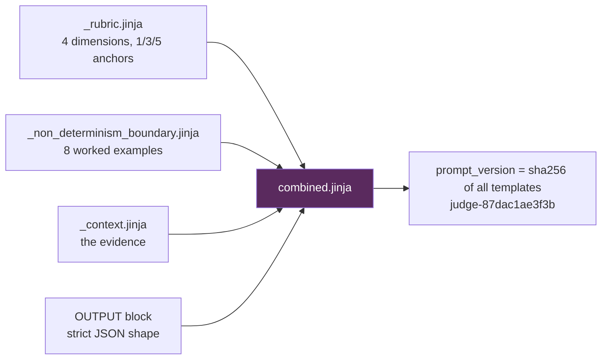

# Judge + Scorecard — Client Walkthrough

Live demo script. 5 minutes of talking, one `--limit 3` run going in the
background while you talk through the code.

---

## Step 0 — Before anything runs: tokens and config

Everything lives in the repo-root `.env`. Two things are needed: **where** to
send questions, and **a token Pulse accepts**.

```ini
PULSE_BASE_URL=https://api-qa.platform.claris.com
PULSE_ORG_ID=4104
PULSE_AUTH_TOKEN=<JWT>
```

### Getting the token from Chrome

Show this live — it is the part everyone asks about:

1. Open Pulse Studio, log in, open **DevTools → Network**
2. Ask any question in the chat
3. Find the `tco/chat` request → **Headers → Authorization**
4. Copy everything after `Bearer ` into `PULSE_AUTH_TOKEN`

**Two things worth saying while you do it:**

- The token Pulse accepts is **not** the Cognito token. Cognito authenticates the
  user; Claris mints its own `claris.com` token from it, and that is the Bearer.
  You can see both in DevTools — they have different `aud` claims.
- **That token lives one hour.** Fine for a 3-question demo, not for a 179-question
  run. So for real runs we configure the refresh chain instead and the run re-mints
  itself:

```ini
PULSE_REFRESH_TOKEN=<Cognito refresh token>
PULSE_COGNITO_CLIENT_ID=<clientID>
PULSE_COGNITO_REGION=us-west-2
```

We re-mint at **5 minutes remaining**, not on expiry — a question can take 200s,
so a token with 60s left dies mid-question and the answer is lost. The last full
CRM run re-minted 8 times across 2.9 hours with zero auth failures.

Preflight before a demo, so you never debug credentials in front of an audience:

```bash
python judge/pulse_auth.py --probe      # verifies the whole token chain
python main.py check-auth --domain crm  # verifies judge + platform creds
```

---

## Step 1 — Kick off the run, then talk over it

```bash
python main.py judge --domain crm --profile full --limit 3
```

Defaults are already what you want: `--pulse live` (the real platform),
`--judge llm`, `--pulse-concurrency 4`, `--concurrency 4`.

> **Use `--version v1.0.0`, or omit `--version` entirely.** Only `v1.0.0` exists
> on disk; `--version v1.0.1` resolves to a bundle that isn't there and the run
> exits immediately. Omitting it picks up the domain default, which is `v1.0.0`.

**Concurrency stays at 4.** It is set in `config/judge/default.json` and is the
level the platform sustains reliably; we do not push past it.

The console prints one line per question as it lands, so the audience can see it
working rather than watching a blank terminal:

```
[judge] platform    1/3    41.2s  ok      CRM-T1-01-01
[judge] scored      1/3    overall=5.00   CRM-T1-01-01
```

---

## Step 2 — Where the question comes from

`release/v1.0.0/crm/qa_pairs/crm_judge_input.csv` — 179 rows, 13 columns. Open it
and show one row:

| Field | Used for |
|---|---|
| `question_id`, `domain`, `tier`, `family` | identity and reporting |
| `natural_language_question` | **this is what we send to Pulse** |
| `expected_answer` | deterministic ground truth, e.g. `28725` |
| `judge_reference` | the ideal full response a good platform would give |
| `reference_sql`, `reference_tables`, `reference_fields` | how the ground truth was derived |
| `derivation_rationale`, `scoring_mode`, `rephrase_group_id` | provenance |

Only **one** field goes to the platform: `natural_language_question`. Pulse never
sees the expected answer or the reference SQL.

---

## Step 3 — The call to Pulse

One POST per question. `stream=false`, so one JSON body comes back carrying both
the answer and the SQL.

```http
POST {base}/api-proxy/org/4104/ai-svc/v2/tco/chat
Authorization:     Bearer <jwt>
X-Claris-Features: TCOApiV2Feature
X-Request-ID:      <uuid4>      ← new per attempt, for correlating with their logs

{ "prompt": "<the natural-language question>",
  "messages": [{"content": "...", "role": "user"}],
  "chat_session_id": "...", "message_session_id": "...",
  "model_name": "...", "is_quick_prompt": false,
  "stream": false, "stream_thinking": false }
```

If the call fails we retry rather than lose the question:



A **401** gets an immediate free re-mint — waiting does not make a token fresher,
and it must not consume the retry budget. A **403** is deliberately treated
differently: that means not permitted, and refreshing just spends another token on
the same denial.

---

## Step 4 — What we extract from the response

Show a real one: `release/v1.0.0/crm/judge/<run>/pulse_raw/CRM-T1-01-01.json`.
**Every response is kept** — ~75 KB each — so any score can be traced back to the
exact payload that produced it.

```
response
├── response            → stringified JSON: { analysis, dashboard, reasoning }
│                         analysis  = THE ANSWER we score
├── analysis_request[]  → every SQL statement the platform issued
│                         4 statements here: id='primary' + 3 dashboard queries
├── record_counts[]     → rows it extracted, e.g. interactions: 200,000
├── timing              → its own per-stage breakdown
└── error / errorCode
```

Three fields matter to us:

| Extracted | From |
|---|---|
| **the answer** | `json.loads(response)["analysis"]` |
| **the generated SQL** | all of `analysis_request` |
| **evidence** | `record_counts`, `timing`, `latency_s` |

Worth mentioning: the platform issues **several** statements per question — one
headline metric plus dashboard breakdowns — and `primary` is not always the one
that answers the question. So we judge the set as a whole rather than cherry-pick.

---

## Step 5 — Building the judge prompt

The prompt is assembled from templates on disk, never from strings in code:



**What the judge is given:**

| Field | Source |
|---|---|
| `question` | the Q&A pair |
| `expected_answer` | the Q&A pair — deterministic ground truth |
| `judge_reference` | the Q&A pair — the ideal full response |
| `platform_answer` | **from the Pulse response** (`analysis`) |
| `generated_sql` | **from the Pulse response** (`analysis_request`) |

**What it is deliberately NOT given: `reference_sql`.** If the judge saw the query
that produced the right answer it could score SQL by diffing against it instead of
reasoning about it — and the answer leaks. The request object forbids the field, so
passing it raises, and a test enforces that.

Each dimension is anchored explicitly, because the spec does not say which
reference governs which dimension and a judge left to choose drifts between calls:

- **Factual Correctness** → against `expected_answer`
- **Completeness** and **Format Adherence** → against `judge_reference`
- **SQL Plausibility** → against the platform's statements, taken together

`prompt_version` is a **content hash over every template**, so every score carries
the exact prompt revision that produced it.

---

## Step 6 — What comes back, and how it scores

The judge returns strict JSON — rationales first, then scores, so each score
follows reasoning already committed to:

```json
{
  "rationales": {
    "factual_correctness": "The platform answer states the total budget is ...",
    "completeness": "...", "format_adherence": "...", "sql_plausibility": "..."
  },
  "factual_correctness": 5,
  "completeness": 5,
  "format_adherence": 5,
  "sql_plausibility": 4
}
```

```
overall    = mean of the four            (unweighted)
normalized = (overall - 1) / 4           floor is 1, so worst possible = 0.0
```

**Two independent scorers, reported side by side and never blended.**

| | `exact_match` | LLM judge |
|---|---|---|
| How | deterministic string/value compare | model, temperature 0 |
| Asks | "is the number right?" | "is this a good answer?" |
| Tolerance | **zero** numeric tolerance | rubric 1–5 per dimension |

`exact_match` parses the structured `expected_answer` — `;` between records, `|`
between fields — and requires every label to sit **next to its own value**, so an
answer that attaches the right numbers to the wrong entity fails.

Invalid judge output is never repaired. A score of `7`, `"5"` or `5.0` raises and
the question fails rather than being silently clamped.

Everything lands in `results.json`, then:

```bash
python main.py score --domains crm        # the scorecard: PDF + CSV + MD
```

---

## Step 7 — Timing, so expectations are set

Measured from the last full live runs — CRM 179 questions, Sales 104.

| Tier | CRM | Sales |
|---|---|---|
| T1 | ~40s | ~35s |
| T2 | ~165s | ~46s |
| T3 | ~150s | ~44s |
| T4 | ~185s | ~51s |
| T5 | ~200s | ~60s |

So: **T1 is 30–40s, and T2 through T5 run 150–200s on CRM.** Sales stays in the
35–60s band across every tier.

> If you plan to say "T1 and T2 are 30–40s", that holds for Sales but not CRM —
> CRM's T2 measured ~165s. Safer line: *"T1 is 30–40 seconds; deeper tiers run
> 150–200 seconds on CRM, and Sales is faster across the board."*

**Why the spread:** it tracks the data extracted, not question difficulty.
Extraction is 68% of CRM's time (109s) versus 23% of Sales' (11s), and CRM pulls a
median **257,480 rows per question** against Sales' 20,400.

```
whole domain = (questions × median seconds) / concurrency 4

CRM    179 questions → ~2.9 hours
Sales  104 questions → ~24 minutes
```

---

## Step 8 — Edge cases where the platform most often fails

From the full runs, in order of how often they bite. Every question below is
quoted exactly as it was sent.

### a. The same value resolves correctly in most questions and fails in a few

This is the clearest finding, and it needs no reference to our data at all — it
is the platform contradicting itself inside a single run (`20260928T093011Z`).

| Value | Reported **with a figure** | Returned zero / "does not exist" |
|---|---|---|
| `High` (priority) | 25 questions | 2 |
| `ServiceRequest` (category) | 37 questions | 1 |
| `EmailOpen` (interaction type) | 25 questions | 2 |
| `Reengagement` (campaign type) | 20 questions | 4 |
| `FinancialServices` (industry) | 13 questions | 4 |

So the value is resolved correctly the large majority of the time, then is
unavailable on a handful of questions in the same run against the same tables.
Two examples, minutes apart:

> **"How many support cases fall under access?"** · `CRM-T1-04-15` · answered
> correctly, **24,053**, and its own status breakdown goes on to report figures
> for `High` priority cases.

> **"How many support cases are logged at high priority?"** · `CRM-T1-03-12`
> Pulse: *"The support_cases priority field has observed values of 'Critical'
> and 'Low' in the data; a 'High' priority value has not been confirmed to
> exist."*

**Both statements cannot be true.** This is the question to bring: why does the
same value resolve in 25 questions and get reported as unconfirmed in 2?

Two failure shapes, from the same cause:

**Returns zero — the dangerous one, because a zero looks like an answer.**

> **"How many interactions are email opens?"** · `CRM-RG-15-V01` · correct **28,725**
> Pulse: *"The data shows a total of 0 interactions recorded as email opens."*

> **"What is the total budget of re-engagement campaigns?"** · `CRM-T1-01-04` · correct **23,620,415.61**
> Pulse: *"No budget data was found for re-engagement campaigns — the query returned a null total."*

> **"What percentage of support cases for accounts in financial services were resolved within their SLA deadline?"** · `CRM-T2-08-37` · correct **22.84**
> Pulse: *"No data was found for this question. The query returned zero resolved support cases for accounts in financial services."*

> **"How many leads came from the event booth source?"** · `SALES-T1-03-11` · correct **3,010**
> Pulse: *"No leads were found from the 'event booth' source in the data."*

**Asks instead — better behaviour for the same problem.** Note the correct
answers are exactly the row counts it calls unconfirmed:

> **"How many support cases are logged at high priority?"** · `CRM-T1-03-12` · correct **32,666**
> **"How many support cases fall under service request?"** · `CRM-T1-04-18` · correct **23,815**
> **"How many high-priority support cases were resolved within their SLA deadline?"** · `CRM-T1-07-30` · correct **7,550**

For completeness, the data was unambiguously present: the platform's own
`record_counts` reported **144,000** `support_cases` rows on every question in
that run, the upload verified `rows_on_platform=144000`, and the uploaded CSV
holds `High` on 32,666 rows and `ServiceRequest` on 23,815. But the finding does
not rest on any of that — it rests on the platform's own two answers.


### b. Aggregate when a list was asked — 16 CRM, 13 Sales

A question naming entities gets a roll-up instead.

> **"Right now, which accounts are carrying the biggest unresolved queue of access support cases?"** · `CRM-RG-05-V01`
> Correct answer **Brown LLC 5; Gibson Ltd 5; Johnson Nichols 5; Long C…**
> Pulse: *"Across the organization there are 13,070 unresolved access support cases currently open."*

The question asks which accounts; the answer is an organisation-wide total.

### c. Intermittent hangs — 16% of CRM

29 of 179 exceeded the 420s client timeout while the platform never
self-reported over 288s, so the retry recovers them. Worth being precise: these
are a **latency** problem, not a correctness one.

> **"How many awareness campaigns have no attributed interactions?"** · `CRM-T3-05-25`
> Correct answer **378** · Pulse answered **378** — correct
> Platform self-reported 249s; client observed **1,160s**, i.e. timeout then retry

### d. Same question, different score

Three runs of the **identical 10-question Sales set** scored **7/10, 5/10,
8/10** — same questions, same data, same day. Worth stating, because it bounds
how precisely any single run can be read.


---

## Demo checklist

- [ ] `python judge/pulse_auth.py --probe` passes
- [ ] `python main.py check-auth --domain crm` passes
- [ ] Use `--version v1.0.0` or omit it — **not** `v1.0.1`
- [ ] Have `pulse_raw/CRM-T1-01-01.json` open in an editor already
- [ ] Have `crm_judge_input.csv` open at one row
- [ ] Kick the run off **before** Step 2 so it finishes while you talk
