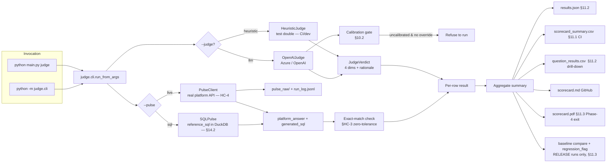
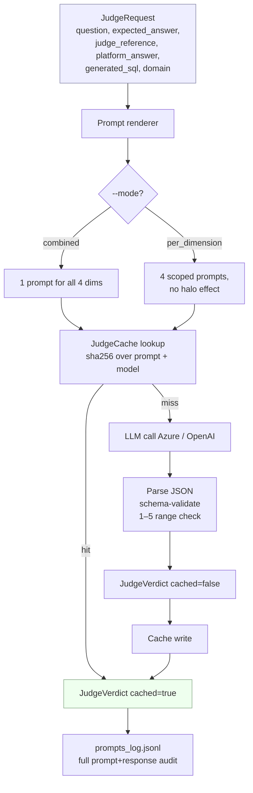
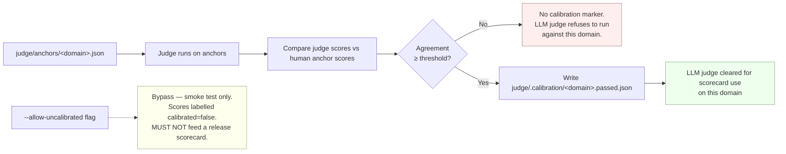
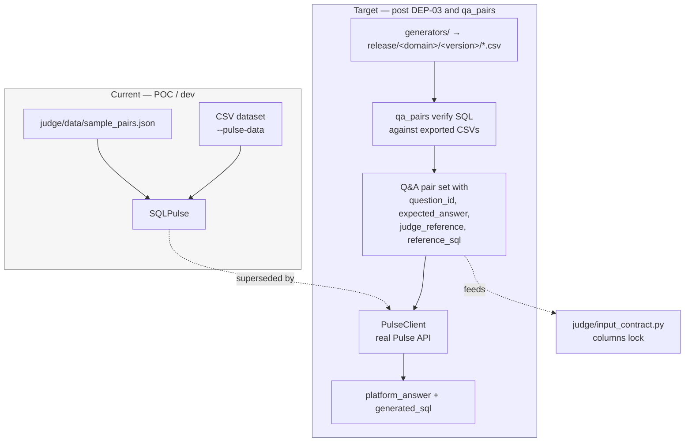
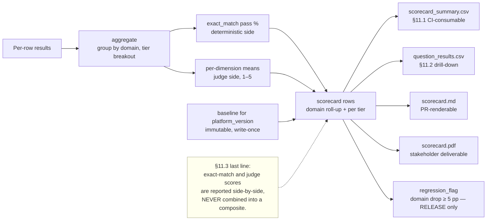

# Judge Flow Diagrams

Post-integration architecture for the [`judge/`](../judge/) module.
Each diagram uses Mermaid — GitHub renders these natively.

## 1. End-to-end flow (integrated CLI)

## 2. Judge internal flow (one row → one verdict)

`reference_sql` is **deliberately not** passed to the judge (per §10.1:
"handing the judge the correct query invalidates the assessment"). SQL
plausibility is scored on the platform-generated SQL alone — the judge sees
the question and the generated SQL, then rates syntactic validity and
logical coherence without a reference to grade against.

## 3. Calibration gate (§10.2)

## 4. Where data comes from (current vs target)

**Current status of the two dependencies:**

- **Real Pulse API** ([`judge/pulse_client.py`](../judge/pulse_client.py) exists):
  blocked on DEP-03, which is blocked on Mac machine network access.
- **`qa_pairs/` module:** stub README in Jarett's repo; the target CSV
  columns (`question_id, domain, tier, nlq, expected_answer,
  judge_reference, reference_sql`) are defined in
  [`judge/input_contract.py`](../judge/input_contract.py).

## 5. Scorecard side-by-side reporting (§11.3)

## Reading these diagrams alongside the code

| Diagram box | Source file |
|---|---|
| `run_from_args` | [`judge/cli.py`](../judge/cli.py) |
| `HeuristicJudge` / `OpenAIJudge` | [`judge/heuristic_judge.py`](../judge/heuristic_judge.py), [`judge/openai_judge.py`](../judge/openai_judge.py) |
| `SQLPulse` / `PulseClient` | [`judge/sql_pulse.py`](../judge/sql_pulse.py), [`judge/pulse_client.py`](../judge/pulse_client.py) |
| Calibration gate | [`judge/calibration.py`](../judge/calibration.py) |
| Prompt renderer | [`judge/prompts.py`](../judge/prompts.py), templates under [`judge/templates/judge/`](../judge/templates/judge/) |
| Parser + validation | [`judge/parsing.py`](../judge/parsing.py) |
| JudgeCache | [`judge/cache.py`](../judge/cache.py) |
| Scorecard writers | [`scorecard/summary.py`](../scorecard/summary.py), [`scorecard/report.py`](../scorecard/report.py) |
| Baseline + regression flag | [`scorecard/baseline.py`](../scorecard/baseline.py) |
| Exact-match | [`judge/exact_match.py`](../judge/exact_match.py) |
| Input contract | [`judge/input_contract.py`](../judge/input_contract.py) |
