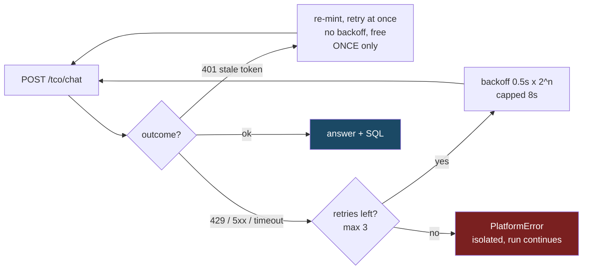
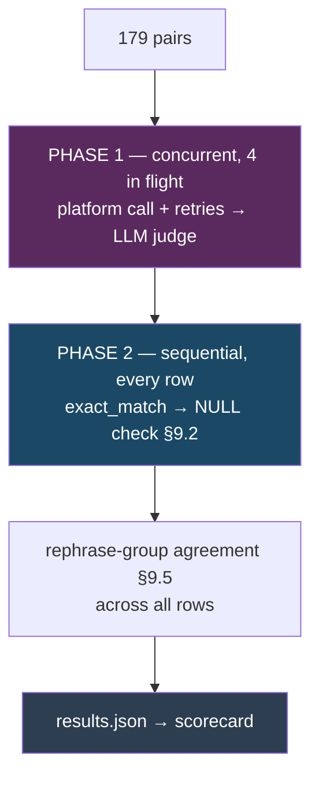

# Pulse / Claris Integration — 5-minute brief

7 Oct 2026 · judge + scorecard · detail in [pulse_api_reference.md](pulse_api_reference.md)

Measured from the two full live runs of 28 Sep: CRM (179 questions) and Sales (104).

---

## At a glance

| | CRM | Sales |
|---|---|---|
| Questions | 179 | 104 |
| Wall clock | **2.9 h** | **24 min** |
| Platform time per question (median) | 161s | 46s |
| T1 → T5 slowdown | 4.9x | 1.7x |
| Rows extracted per question (median) | 257,480 | 20,400 |
| Needed a timeout retry | **29 (16%)** | 1 (1%) |

**Time is driven by how much data the platform extracts, not by how hard the
question is.** CRM is 3.5x slower per question because it extracts 12.6x more rows.

---

## 1. Request, auth and retries

One POST per question: `/api-proxy/org/4104/ai-svc/v2/tco/chat`, `stream=false`,
so one JSON body carries both the answer (`response.analysis`) and the SQL the
platform generated (`analysis_request`).

**The token Pulse accepts is not the Cognito token.** Cognito authenticates the
user; Claris mints its own `claris.com` token from it. So refresh is two steps —
Cognito `REFRESH_TOKEN_AUTH`, then `POST /auth/token` — and that second token is
the Bearer. It lives **one hour**, so any run over an hour needs the chain.



Three points worth making:

- **A 401 gets a free immediate re-mint** — waiting does not make a token
  fresher, and it must not spend the retry budget or a token expiring on the last
  attempt would lose an answer a refresh would have saved.
- **A 403 is deliberately not a 401.** Stale credential vs not allowed; refreshing
  a 403 just spends a second token on the same denial.
- **We refresh at 5 minutes remaining, not on expiry**, because a question takes
  161s and a token with 60s left dies mid-question. The 2.9-hour CRM run re-minted
  8 times with **zero 401s across 283 questions**.

---

## 2. Judge workflow

Two phases: a concurrent one that talks to the network, then a sequential one
that scores once every answer is in hand.



**Two independent scorers, never blended into a composite (§11.3).**
`exact_match` asks "is the number right" — deterministic, zero numeric tolerance.
The LLM judge scores four dimensions 1–5 (factual correctness, completeness,
format adherence, SQL plausibility). They run at different times from different
inputs, so neither can see the other's verdict, and a disagreement is information.

How the prompt is built, in one line each:

- Templates on disk, never in code; `prompt_version()` is a **content hash** over
  them, so every score carries the exact prompt revision that produced it.
- **`reference_sql` is withheld.** `JudgeRequest` forbids it and a test asserts
  that — otherwise the judge could score SQL by diffing against the right query,
  and the answer leaks.
- The **anchoring map is explicit**: factual correctness against
  `expected_answer`, completeness and format against `judge_reference`, SQL
  plausibility against the platform's statements taken together. §10.1 does not
  say which anchors which, and a judge left to choose drifts between calls.
- The prompt carries **eight worked examples** of the HC-3 boundary, because
  stating "phrasing is not a deduction" as a rule is not enough — without
  examples judges over-penalise wording and corrupt every regression comparison.
- Invalid output is **never repaired**. A score of 7, `"5"` or `5.0` raises and
  the question fails. Clamping would invent a measurement.

---

## 3. Time per domain and tier

Platform self-reported, so our retries and network are excluded.

| Tier | CRM | Sales |
|---|---|---|
| T1 | 41s | 35s |
| T2 | 166s | 46s |
| T3 | 149s | 44s |
| T4 | 183s | 51s |
| T5 | **199s** | **60s** |
| all | **161s** | **46s** |

**Not monotonic** — T2 exceeds T3 in both domains, so "higher tier = slower" is
the wrong model. Tier correlates with time only because higher tiers touch more
tables. The platform's own breakdown says extraction is 68% of CRM's time (109s)
but only 23% of Sales' (11s), and within CRM, above-median row counts take 219s
against 123s.

```
estimate = (questions × median platform seconds) / concurrency 4

CRM    179 × 161 / 4 = 120 min ideal   vs 177 actual   ← the gap is retries
Sales  104 ×  46 / 4 =  20 min ideal   vs  24 actual
```

The judge adds no measurable wall clock — it is interleaved, and the platform is
the bottleneck. Finance, Logistics and PM have never been run, so their time is
not yet knowable; CRM and Sales differ 3.5x on identical tier structure.

---

## 4. Where the platform fails

### a. Enum values it cannot see — the big one

The platform's profiling of a column is **incomplete**, and it acts on the
incomplete picture. Checked against the data we uploaded:

| Column | Values actually present | What the platform said |
|---|---|---|
| `support_cases.priority` | Critical, Low, **High (32,666 rows)**, **Medium (60,701)** | "observed values of 'Critical' and 'Low'; a 'High' priority value has not been confirmed to exist" |
| `support_cases.category` | Billing, Integration, Access, ProductIssue, **GeneralInquiry**, **ServiceRequest (23,815)** | listed four; "there is no 'Service Request' category in the data" |

It missed values holding **17–23% of 144,000 rows**. The same defect then shows
up two different ways:

**Silently returns zero — 10 questions.** This is the dangerous one, because a
zero looks like an answer:

| Question asks | Stored literal | Expected | Platform said |
|---|---|---|---|
| "email opens" | `EmailOpen` | 28,725 | "a total of 0 interactions" |
| "re-engagement campaigns" | `Reengagement` | 23,620,415.61 | "no budget data was found" |
| "financial services" | `FinancialServices` | 22.84% | "returned zero resolved support cases" |
| "event booth source" | `EventBooth` | 3,010 | "no leads were found" |
| "cold call leads" | `ColdCall` | 844 / 789 / 729 / 726 | "no quoted deals were found" |

**Asks for clarification — 3 questions.** Here it notices and asks, e.g. *"Should
I count cases with priority = 'Critical' as 'high priority'?"* — which is the
right behaviour for the same underlying problem.

**So: same defect, two behaviours, and no way to predict which.** Worth asking
them why profiling misses values at 23% frequency, and why an unresolved literal
sometimes returns zero instead of asking.

### b. Answers an aggregate when a list was asked — 16 CRM, 13 Sales

"Which accounts carry the biggest unresolved queue of access support cases?"
returns a single total rather than naming the accounts. The question asks for
entities; the response gives a roll-up.

Every case counted here has been checked individually against the question
wording and the reference SQL, so each one holds up if challenged.

### c. Intermittent hangs — 16% of CRM

Client latency exceeded our 420s timeout on 29 of 179, while the platform never
self-reported more than 288s. The retry usually succeeds, so the retry path is
load-bearing in production, not theoretical.

### d. Substance-level non-determinism

Three runs of the **identical 10-question Sales set** scored **7/10, 5/10, 8/10**.
Same questions, same data, same day. This bounds how precisely any single run can
be quoted.

---

## 5. Two asks

- **Log our retries.** The 16% figure is inferred from the latency gap, not
  proven, because retries are not currently recorded.
- **`.env.example` is stale** — documents `PULSE_TIMEOUT_S=180` and "~30s per
  question"; the code default is 420s and the measured median is 161s. Configuring
  from the example would push the retry rate well above 16%.

---

## 6. Internal — hold unless asked

Not for the client call. These are ours to close before any accuracy figure goes
out, and they are the reason a number should not go out yet.

- **6 T5 pairs need a question-wording fix.** The reference SQL carries `LIMIT 5`
  while the question asks which accounts qualify, so the platform's roll-up answer
  is reasonable and our expected answer is the narrow one. Excluded from §4b
  above rather than counted against the platform. Owner: Q&A.
- **CRM sits at 101/179** after the Q&A fixes already landed (the T2-08 SLA
  denominator) plus our precision-rendering change. Do not quote it externally
  until the 6 above are resolved — it will move, and a number that moves after
  being quoted is worse than no number.

