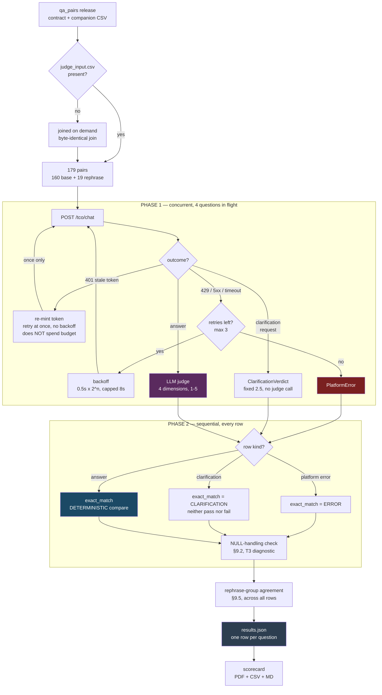
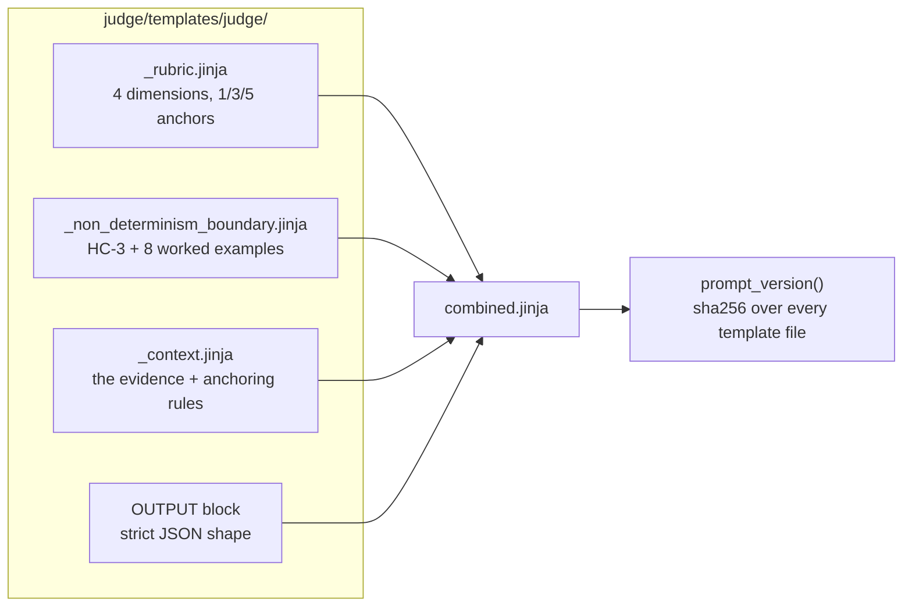
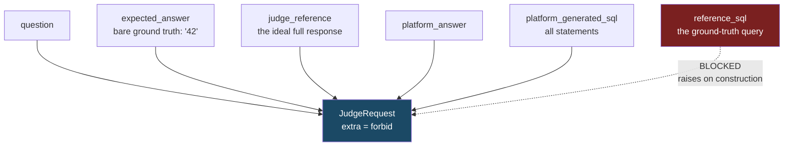
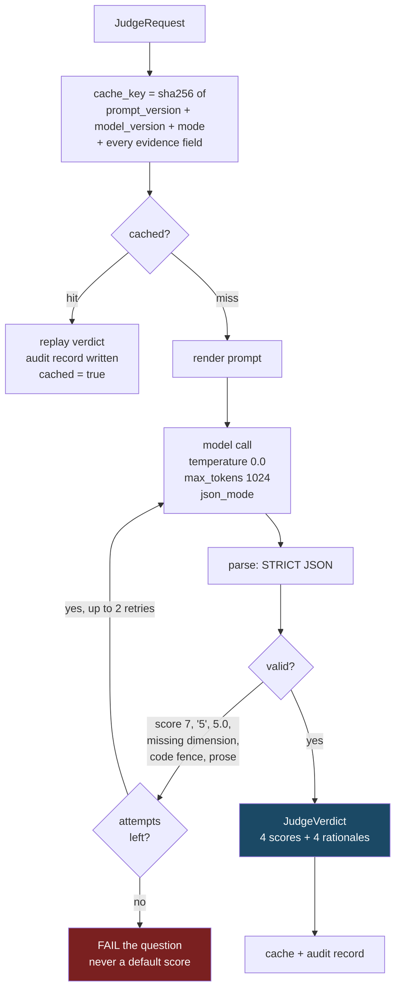

# Pulse / Claris API — Reference

Full detail behind [pulse_api_brief.md](pulse_api_brief.md), which is the
5-minute version. Keep this one open during the call to answer follow-ups.

All timings are measured, not estimated. Source: the two full live runs of
28 Sep 2026 — CRM (179 questions, `20260928T093011Z`) and Sales (104 questions,
`20260928T084857Z`), read from each run's `run_log.jsonl`.

---|---|---|
| 1 | **At a glance** — the whole story if you run short | 20s |
| 2 | **§1** request path, **§2** the two-token chain | 60s |
| 3 | **§3** retry table, and that a 403 is not a 401 | 40s |
| 4 | **§4.1** the end-to-end flowchart, and that the two scorers never combine | 60s |
| 5 | **§4.2** what the judge is shown — and that `reference_sql` is blocked | 45s |
| 6 | **§5** the per-tier table and what drives the time | 60s |
| 7 | **§6** the two findings | 30s |

Hold §4.3–4.6 and the appendix in reserve. §4.6 (determinism and calibration) is
the one most likely to be asked about unprompted.

---

## At a glance

| | CRM | Sales |
|---|---|---|
| Questions | 179 | 104 |
| Wall clock | **2.9 hours** | **24 minutes** |
| Platform time per question (median) | 161s | 46s |
| T1 → T5 slowdown | 4.9x | 1.7x |
| Rows extracted per question (median) | 257,480 | 20,400 |
| Platform errors / auth failures | 0 / 0 | 0 / 0 |
| Requests needing a timeout retry | **29 (16%)** | 1 (1%) |

The headline: **time is driven by how much data the platform extracts, not by how
hard the question is.** CRM takes 3.5x longer per question than Sales because it
extracts 12.6x more rows.

---

## 1. How a question reaches Claris

One POST per question. No streaming by default.

```http
POST https://api-qa.platform.claris.com/api-proxy/org/4104/ai-svc/v2/tco/chat

Authorization:     Bearer <jwt>
Content-Type:      application/json
X-Claris-Features: TCOApiV2Feature
X-Request-ID:      <uuid4>

{ "prompt": "...", "messages": [{"content": "...", "role": "user"}],
  "chat_session_id": "...", "message_session_id": "...",
  "model_name": "...", "is_quick_prompt": false,
  "stream": false, "stream_thinking": false }
```

Two things worth calling out:

- The **`Bearer ` prefix is required**. A raw JWT returns `401 "failed to parse token"`.
- **`X-Request-ID` is new per attempt**, so a retried question can be correlated
  against the platform's own logs.

### What we read back

With `stream=false` the whole thing arrives as one JSON body, and we take three
things from it:

| What | Where |
|---|---|
| The natural-language answer | `json.loads(response)["analysis"]` |
| The SQL the platform generated | `analysis_request`, the entry with `id: "primary"` — the others build the dashboard, not the answer |
| Evidence for the scorecard | `record_counts`, `timing` |

`timing` is the reason everything in section 5 exists: the platform reports its
own per-stage breakdown, so we can separate its latency from ours.

SSE streaming is supported (`PULSE_STREAM=true`), but non-stream is the default
because it carries the answer *and* the generated SQL in a single body.

---

## 2. Token configuration

### The key point: the token Pulse accepts is not the Cognito token

Two distinct ID tokens exist. Conflating them is the usual failure mode.

```
Cognito    iss = https://cognito-idp.us-west-2.amazonaws.com/us-west-2_JtNIWdiHP
           aud = 1orc9knial20pdfguri4mn40pm

Pulse      iss = claris.com
           aud = 30henrpro070ji15vqg01918h2      (= the mag.cid cookie)
```

Cognito authenticates the user; **Claris then mints its own ID token from the
Cognito one**. So refreshing is two steps, not one:

```
1.  Cognito InitiateAuth / REFRESH_TOKEN_AUTH
      -> fresh Cognito AccessToken + IdToken
      (the refresh token itself is long-lived — Cognito default 30 days — and is
       NOT re-issued unless the pool has rotation enabled)

2.  POST {PULSE_BASE_URL}/auth/token  with those tokens
      -> the claris.com ID token that every question sends as its Bearer
```

### Configuration

```ini
PULSE_BASE_URL=https://api-qa.platform.claris.com
PULSE_ORG_ID=4104
PULSE_AUTH_TOKEN=<the current claris.com JWT>     # lives ONE HOUR

# ...so for any run longer than an hour, the refresh chain is required:
PULSE_REFRESH_TOKEN=<Cognito refresh token>
PULSE_COGNITO_CLIENT_ID=<the clientID Studio posts to /auth/token>
PULSE_COGNITO_REGION=us-west-2
PULSE_AUTH_EXCHANGE_PATH=/auth/token
```

All of it lives in the repo-root `.env`. The Cognito refresh token mints access
tokens for weeks, so it is a far more sensitive credential than the hour-long ID
token — it belongs in `.env` only, never in a config file or a log.

### One honest caveat

**We never captured step 2's response shape.** The request was taken from the
browser; the response was not. Rather than hardcode a field name that might be
wrong, we locate the platform token by matching the `aud` of the token already
in `.env` — which is by definition the audience Pulse accepts.

```bash
python judge/pulse_auth.py --probe     # verifies the whole chain before a run
```

### Why we refresh early rather than on expiry

A token with 60 seconds left will die *mid-question*, and the answer is lost
rather than delayed — a CRM question takes 161s at the median and up to 288s. So
we re-mint when **under 5 minutes** remain (`TOKEN_REFRESH_MARGIN_S = 300`).

**Evidence it works:** the 2.9-hour CRM run re-minted 8 times — 4 at startup, one
per worker, then at 55m, 111m and 169m — with **zero 401s across all 283
questions** in both runs.

---

## 3. Retry mechanism

Three separate paths, deliberately not one generic retry. Each failure means
something different, so each is handled differently.

| Trigger | Behaviour | Why |
|---|---|---|
| **401** | Re-mint the token, retry **immediately** — no backoff. Does **not** consume the retry budget. Exactly once. | Waiting does not make a token fresher. And a token expiring on the final attempt would otherwise lose an answer a refresh would have saved. If the *fresh* token is also rejected, the credential source is the problem and retrying just burns tokens. |
| **429 / 5xx** | Exponential backoff — `0.5s × 2^attempt`, capped at 8s — up to 3 retries | The platform is busy or broken; backing off is the cooperative response. |
| **Transport** (timeout, connection reset) | Same backoff, but only if classified transient | A non-transient transport error will not fix itself. |

**A 403 is deliberately not treated as a 401.** A 401 means the credential is
stale, which a refresh fixes. A 403 means this identity is not allowed to do
this — refreshing just spends a second token on the same denial.

Per-attempt timeout: **420s** (`PULSE_TIMEOUT_S`). Retry budget:
`PULSE_MAX_RETRIES=3`.

### Measured behaviour

```
auth retries (401s)      0 of 283 questions
platform errors          0
judge errors             0
```

The proactive refresh means the reactive 401 path never had to fire. But see the
finding in section 6 — the *timeout* path fired a lot.

---

## 4. The judge workflow

### 4.1 One run, end to end

A run has **two phases**: a concurrent phase that talks to the network, and a
sequential phase that scores deterministically once every answer is in hand.



**Why two phases matters.** The LLM judge runs inside the concurrent phase, one
call per answered question. `exact_match` does **not** — it runs afterwards in a
plain loop over every collected row. So the two scorers are independent in the
strong sense: they run at different times, from different inputs, and neither can
see the other's verdict.

The two scorers are also **never blended into a composite (§11.3)**. They measure
different things — `exact_match` asks "is the number right", the judge asks "is
this a good answer" — and a disagreement between them is information, not an
error to reconcile.

Three details the chart makes explicit because they are easy to get wrong:

- **An error or clarification still gets an `exact_match` value**, `ERROR` or
  `CLARIFICATION`. Those rows are not silently absent from the deterministic
  column; a clarification is explicitly *neither a pass nor a fail*.
- **A clarification never reaches the judge.** The score is fixed at 2.5 and the
  dimensions stay null on purpose — no rubric produced them — which saves a ~12s
  provider round-trip that could not have changed the outcome.
- **Two checks run beyond the two scorers.** The §9.2 NULL-handling check is a
  per-row T3 diagnostic, and the §9.5 rephrase-group check runs *across* rows to
  confirm every variant of one question resolved the same ground-truth values.
  Both are reported beside the scores and never folded into them.

**Note on the first step:** `judge_input.csv` is a judge-side artifact, not part
of the sealed Q&A release — the release deliberately splits the §9.3 contract
from the identifiers. The judge **joins it on demand** if it is absent, using the
same deterministic join the `judge-build-input` command performs. Same release
in, byte-identical CSV out, so "did you remember to run `judge-build-input`
first?" is a question nobody has to answer.

**The retry loop is the same one described in §3**, drawn here because it sits in
the per-question path: up to **3 retries** with exponential backoff on
429/5xx/timeout, plus a **single free token re-mint** on a 401 that does not
consume the retry budget. Only after the budget is exhausted does the question
become a `PlatformError` — and even then it is isolated, so one bad question
cannot lose a 3-hour run.

**Two separate concurrency limits** govern the concurrent phase —
`pulse_concurrency` and `judge_concurrency`, both 4 — because the platform and
the judge provider have unrelated rate limits.

### 4.2 How the prompt is built

Prompt text lives in `judge/templates/judge/`, **never in code**. One prompt is
assembled from four blocks:



`prompt_version()` is a **content hash over all template files**, so it changes
automatically when a template does. Every score carries the exact prompt
revision that produced it — something a hand-maintained version string cannot
guarantee.

Rendering uses Jinja's `StrictUndefined`: a mistyped variable **raises at render
time** rather than silently rendering an empty string, which would otherwise
produce a confident score based on missing evidence.

#### What the judge is shown, and what it is deliberately not



**`reference_sql` is withheld on purpose.** If the judge saw the query that
generated the right answer it could score SQL plausibility by diffing against it
instead of reasoning about it — and worse, the answer leaks. `JudgeRequest` sets
`extra="forbid"` so passing it raises, and a test asserts that.

#### The anchoring map

§10.1 says the judge receives all four evidence fields but does not say which
reference anchors which dimension. We state the mapping explicitly, because a
judge left to choose **drifts between them across calls**:

| Dimension | Judged against |
|---|---|
| Factual Correctness | `expected_answer` — the deterministic ground truth |
| Completeness | `judge_reference` — the ideal full response |
| Format Adherence | `judge_reference` |
| SQL Plausibility | the platform's SQL statements, **taken together** |

Two refinements that came out of real runs:

- **SQL plausibility judges the whole set.** The platform issues several
  statements per question — one headline metric plus dashboard breakdowns — and
  the one labelled `primary` is *not* necessarily the one that answers the
  question. Scoring only `primary` penalised correct behaviour.
- **Length is explicitly not rewarded.** A short correct answer must score as
  highly as a long one.

#### The non-determinism boundary block

This is the load-bearing part of the prompt. HC-3 protects phrasing and fails
only numeric variance, but stating that as a rule is not enough — **without
worked examples judges consistently over-penalise phrasing variation**, which
corrupts every downstream regression comparison.

So the prompt carries eight labelled examples, with the exact scores to assign:

| | Case | Verdict |
|---|---|---|
| A | `72` → "There are 72 active accounts in the CRM." | no deduction |
| B | `4,182,650.00` → "closed $4,182,650 in Q2" | no deduction — currency and `.00` are cosmetic |
| C | `5 orphan contacts` → "Five contacts have no account assigned." | no deduction — spelled numeral |
| D | three values, order reversed | no deduction — every value present |
| E | `72` → "68 active accounts" | `factual_correctness = 1` |
| F | `4,182,650.00` → "4,182,000" | `factual_correctness = 1` — rounding loss is numeric variance |
| G | asked for rep **and** value, got only the value | `factual = 5`, `completeness = 3` |
| H | asked for figures, got a category name | `factual = 1`, `completeness = 1` |

G and H are the pair that matters: both are incomplete, and the prompt says
which is a 3 and which is a 1, so "incomplete" does not collapse to one score.

Finally, the output block requires **rationales first, then scores** — so each
score follows from reasoning the model has already committed to, and stays
independently auditable.

### 4.3 How a verdict is produced and validated



**Invalid output is never repaired.** A score of 7, a score of `"5"`, a score of
`5.0`, or a missing dimension all raise. Clamping 7 to 5 would be inventing a
measurement the judge never made — so the question fails and says so.

The cache key includes **`mode`** deliberately: a `combined` verdict must never
be served to a `per_dimension` request, or the comparison between the two modes
becomes meaningless.

Every attempt — including a cache replay — writes a §10.1 audit record, so a
score can always be traced to the prompt, model and raw response that produced
it.

### 4.4 Turning four scores into one number

```
overall     = mean(factual_correctness, completeness,
                   format_adherence, sql_plausibility)      # unweighted

normalized  = (overall - 1) / 4
```

**`(x-1)/4`, not `x/5`.** The scale floor is 1, so the worst possible verdict
must map to 0.0. Using `x/5` gives an all-1s verdict 20% credit and silently
inflates everything above it.

### 4.5 The deterministic scorer, for contrast

`exact_match` does not use a model at all. It parses the structured
`expected_answer` the generator produced — `;` separates records, `|` separates
fields — classifies every field, and checks each on its own terms:

| Kind | Rule |
|---|---|
| NUMERIC | must be present **by value** — `28,731` equals `28731` |
| DATE | must be present, exact day, zero tolerance |
| LABEL | must be present **and sit next to its own value** |
| MIXED | its numerics are required, its words are not |
| PROSE | advisory only |

**The LABEL proximity rule is the load-bearing one.** Comparing numerics alone
would pass an answer that attaches every right number to the wrong entity —
"Bob Smith closed 4,182,650.00" against an expected "Priya Raghavan —
4,182,650.00" — which is the shape of most T4/T5 pairs.

Stated residual risk: for a **bare scalar with no label to anchor it**, presence
is still presence, so a long answer carrying a category breakdown can contain the
expected number incidentally and pass. Nothing in the response payload lets us
bind a bare number to its role, so this is a floor on the method, not a bug.

### 4.6 Determinism and calibration

| Control | Value | Note |
|---|---|---|
| Model | `anthropic.claude-sonnet-4-6` | pinned in `config/judge/`, so the config — not a developer's `.env` — decides what scores a run |
| Temperature | `0.0` | Sonnet 4.6 accepts it; **Sonnet 5 and Opus 5 reject it outright**, which is why 4.6 is the deliberate choice |
| Seed | `42` configured | **not enforced** — Anthropic exposes no seed parameter, and every run records that caveat rather than claiming determinism it does not have |
| Cache | content-keyed | re-scoring identical evidence returns the identical verdict |

Calibration (§10.2) requires ≥10 human-graded anchors per domain with agreement
within ±1 on ≥90% per dimension. The tooling is built and both gates are
**opt-in and default false**, so a release run never blocks on a session that has
not happened — but every artifact records its calibrated state, so a baseline
established this way can never be mistaken for a calibrated one.

---

## 5. Execution time

### Platform self-reported time per question, by tier

These are the platform's own numbers from its `timing` payload, so they exclude
our retries and network time. This is the honest measure of how fast Pulse is.

| Tier | CRM median | CRM p90 | Sales median | Sales p90 |
|---|---|---|---|---|
| T1 | 41s | 177s | 35s | 45s |
| T2 | 166s | 228s | 46s | 61s |
| T3 | 149s | 243s | 44s | 53s |
| T4 | 183s | 227s | 51s | 67s |
| T5 | **199s** | 252s | **60s** | 95s |
| **All** | **161s** | — | **46s** | — |

Two things to flag when presenting:

- **T1 → T5 is 4.9x on CRM but only 1.7x on Sales.** The progression is not a
  property of the tier definition; it tracks the data each domain holds.
- **It is not monotonic.** T2 exceeds T3 in *both* domains. Tier is not a clean
  complexity ladder, so "higher tier = slower" is the wrong mental model.

### What actually drives the time

The platform's own stage breakdown says it is extraction, not reasoning:

| Stage | CRM (median) | % of CRM time | Sales (median) | % of Sales time |
|---|---|---|---|---|
| extraction | **109s** | 68% | 11s | 23% |
| data_display_preparation | 24s | 15% | **24s** | 52% |
| summarization | 13s | 8% | 13s | 28% |
| analysis | 9s | 5% | 1s | 3% |

> Each figure is that stage's own median across all questions, so the column does
> not sum to the total — Sales adds to ~106% because its stages peak on different
> questions. The ranking and the order of magnitude are the point, not the sum.

And extraction tracks row count almost directly:

```
rows extracted per question (median)      CRM 257,480        Sales 20,400
                                          max 421,480        max  50,800

within CRM:  above-median row count  ->  219s
             below-median row count  ->  123s
```

So the platform appears to re-extract the working set per question. **CRM is
slower because it holds 12.6x more data, not because its questions are harder.**
Note `data_display_preparation` is a flat ~24s in both domains — the dashboard
build is a fixed cost per question regardless of volume.

### Domain wall clock, and how to estimate a new one

```
CRM      179 questions    2.9 hours     (concurrency 4)
Sales    104 questions     24 minutes   (concurrency 4)

estimate  =  (questions × median platform seconds) / concurrency

CRM      179 × 161 / 4  =  120 min ideal   vs  177 min actual
Sales    104 ×  46 / 4  =   20 min ideal   vs   24 min actual
```

The ~57-minute gap on CRM is retry overhead — section 6.

**The judge adds no measurable wall clock.** LLM scoring runs interleaved at the
same concurrency of 4, and the platform is the bottleneck end to end.

### Not yet measurable

Finance, Logistics and Project Management have Q&A pairs but have never been run.
Their execution time depends entirely on their extraction volume, so quoting a
number now would be a guess. CRM and Sales differ by 3.5x on the same tier
structure, which is the range of uncertainty.

---

## 6. Two things to raise

### a. 16% of CRM questions needed a timeout retry

```
requests whose client-observed latency exceeded the 420s timeout:  29 / 179
highest platform self-reported time in the entire run:             288s
highest client-observed latency:                                 1,160s
```

The platform never reported taking more than 288s, yet we observed up to 1,160s.
That pattern means the request hung past our 420s timeout, we timed out, and the
retry succeeded — roughly 4x the work for one answer.

Two consequences:

- **The retry path is load-bearing in production, not theoretical.** Without it,
  16% of the CRM run would have failed.
- **We do not currently log retries**, so this is inferred from the latency gap
  rather than proven from the artifacts. Worth fixing on our side, and worth
  asking the Platform Owner why CRM-scale questions intermittently hang.

### b. `.env.example` is stale and understates the cost

| Documented | Actual |
|---|---|
| `PULSE_TIMEOUT_S=180` | code default is **420** |
| "Pulse answers take ~30s each" | measured median **161s** (CRM), **46s** (Sales) |

Anyone configuring from the example file would set a 180s timeout, which on CRM
would push the retry rate well above 16%.

---

## Appendix — reproducing these numbers

```bash
# the two runs this document is based on
release/crm/eval-runs/20260928T093011Z/run_log.jsonl      # 179 questions, live
release/sales/eval-runs/20260928T084857Z/run_log.jsonl    # 104 questions, live

# the events used
pulse.response          latency_s, server_timing{total_ms, stages[]}, record_counts
pulse.token_refreshed   elapsed_s, expires_at, forced
pipeline.start          pulse_concurrency, judge_concurrency
pipeline.complete       elapsed_s, platform_errors, judge_errors
```

Code references: `judge/pulse_client.py` (request, retry loop, proactive
refresh), `judge/pulse_auth.py` (the two-step token chain).
